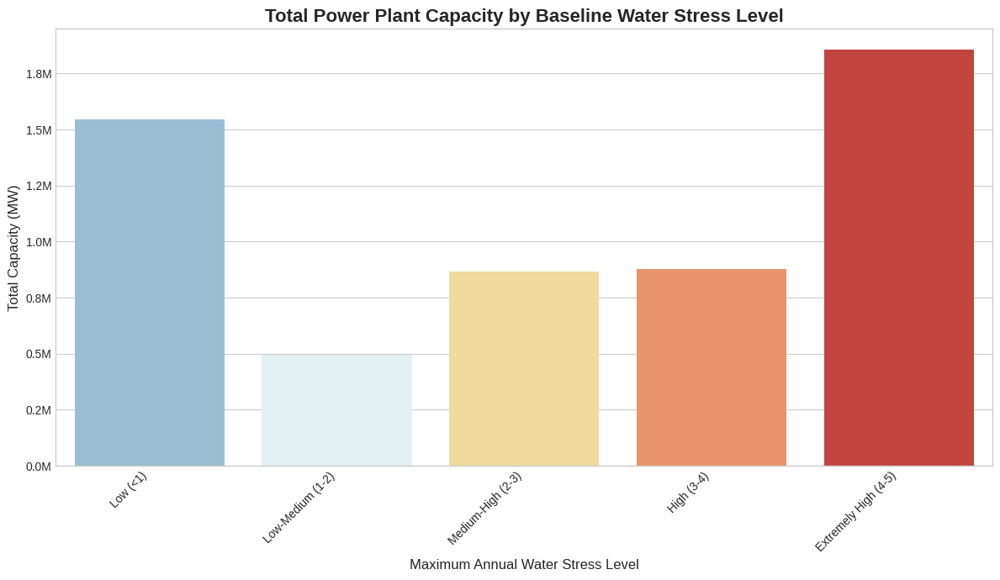
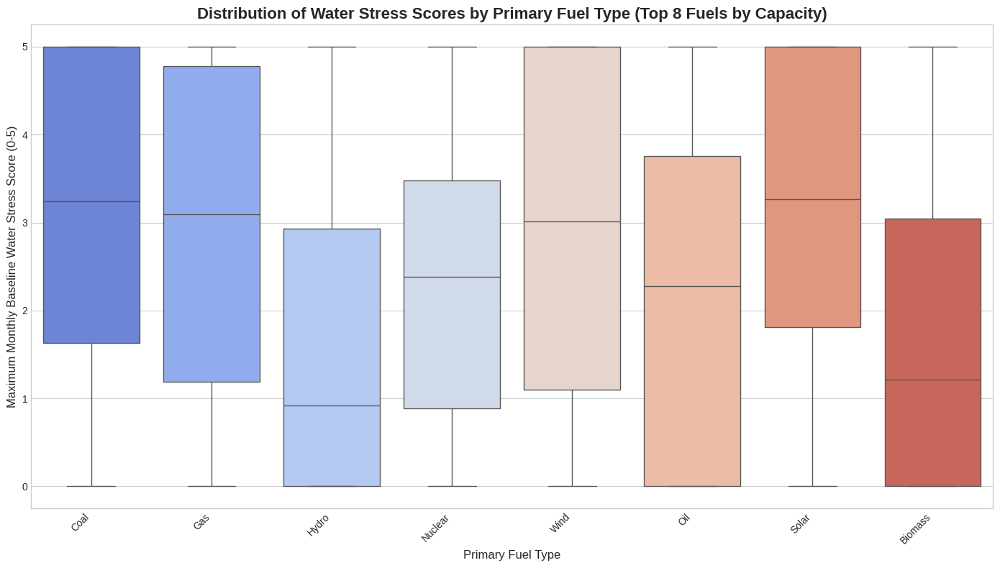
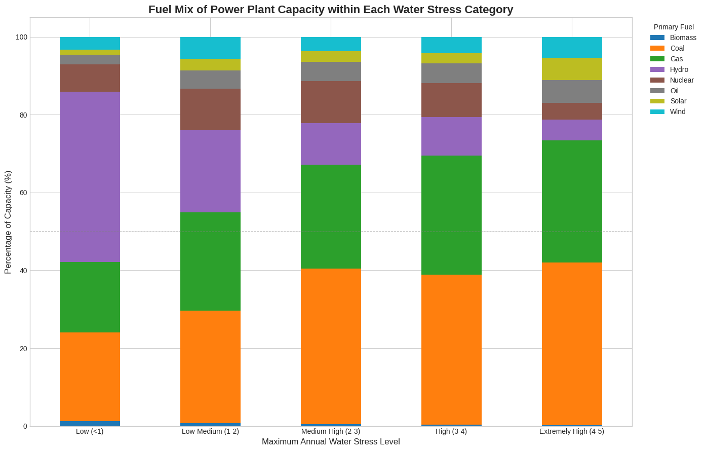
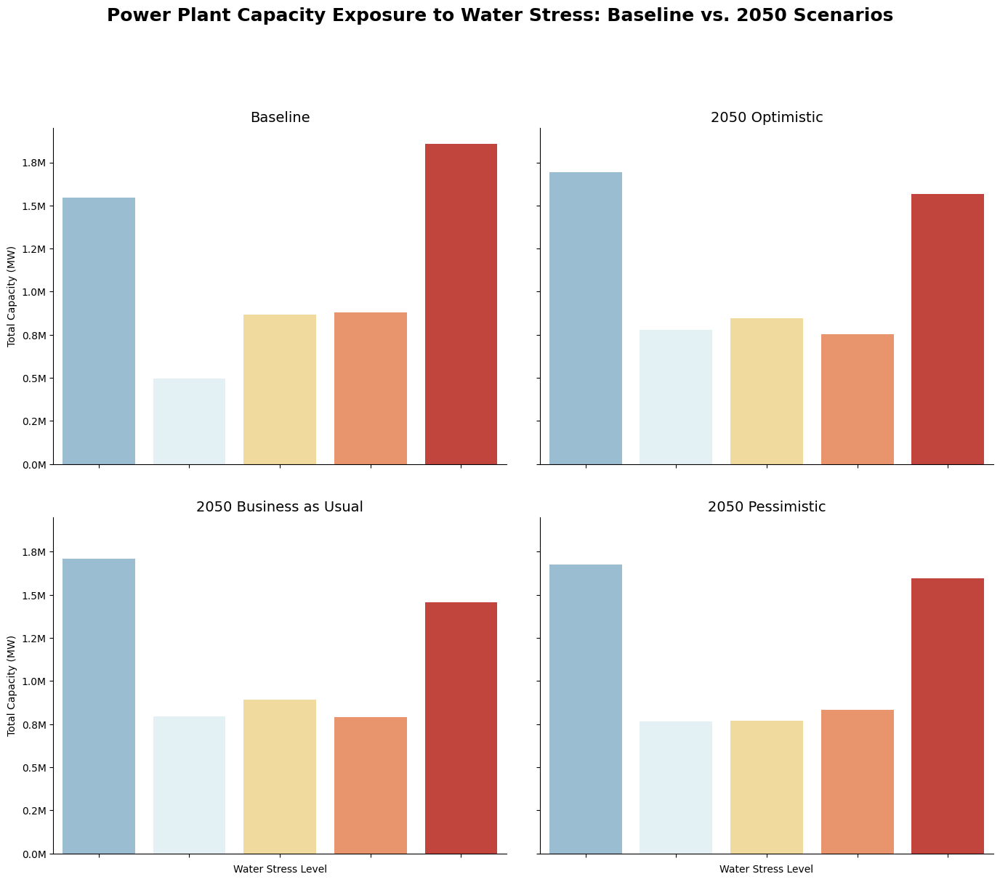
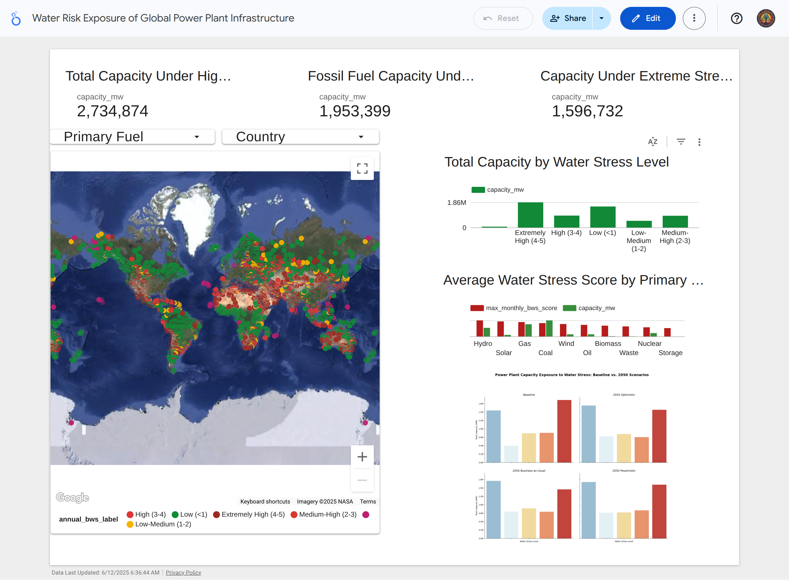

# Final Report: A Global Analysis of Water Risk Exposure for Power Plant Infrastructure

## Introduction

The global energy sector is fundamental to economic development and modern life, yet it faces a critical vulnerability: its deep dependence on reliable water resources. This "water-energy nexus" is under increasing pressure from climate change, population growth, and industrial demand, leading to heightened water stress worldwide. While this systemic risk is acknowledged, a granular, plant-level understanding of this exposure, especially under future climate scenarios, is often lacking.

[cite_start]This project was scoped to address this gap by quantifying the current and projected future water risks for a comprehensive global portfolio of power plants. [cite_start]The resulting analysis, presented in an interactive dashboard, offers a distinct value by translating complex hydrological model data into an accessible tool for policymakers, investors, and researchers, enabling more informed decisions regarding energy security and sustainable development.

## Data Analysis & Computation

### Datasets, Wrangling, & Cleaning

The analysis was performed using three core datasets, all primarily sourced from the World Resources Institute (WRI). The data curation process was documented in a reproducible Python script to ensure transparency and accuracy.

* **Data Sources:**
    1.  **WRI Global Power Plant Database (GPPD):** A comprehensive database of ~35,000 power plants, providing location, capacity, fuel type, commissioning year, and other attributes.
    2.  **WRI Aqueduct 4.0 Water Risk Atlas:** A suite of datasets providing baseline (1979-2019 trend) and future (2050 scenarios) water risk indicators at the hydrological basin level (`pfaf_id`).
    3.  **HydroBASINS Geospatial Data:** Basin polygons (Level 6) used to link the power plant locations to their corresponding water risk data.

* **Data Wrangling and Cleaning Process:**
    * **Geospatial Join:** A critical step was to perform a geospatial join. The point coordinates (`latitude`, `longitude`) of each power plant were used to identify the specific water basin polygon (`pfaf_id`) they reside in. This successfully matched ~99.5% of the plants to a water basin.
    * **Attribute Joins:** The baseline and future water risk indicators were then merged with the power plant data using `pfaf_id` as the common key.
    * **Handling Special Values:** During initial review, it was discovered that the Aqueduct data uses `-9999` as a "No Data" code within its numeric columns. [cite_start]This procedure was justified to ensure accurate calculations by replacing these values with a standard `np.nan`.
    * **Handling Anomalies:** The GPPD contained instances of negative reported generation values. [cite_start]As negative gross generation is not physically meaningful in this context, these values were capped at zero to maintain the integrity of the dataset.
    * **Final Dataset:** This process resulted in a single, unified analytical dataset (`analytical_data.pkl`) containing all power plant attributes and their corresponding baseline and future water risk indicators.

### Exploratory Data Analysis (EDA)

The EDA phase focused on answering key questions about the distribution and nature of water risk. [cite_start]Key insights were derived from a series of visualizations, as required by the project guidelines to showcase the investigative process.

* **Insight 1: A significant portion of global power capacity is exposed to elevated water stress.**
    * A bar chart visualizing the total capacity (MW) by baseline water stress category revealed that the "Medium-High," "High," and "Extremely High" categories combined represent a critical portion of global infrastructure.
  
      **

* **Insight 2: Water stress exposure varies significantly by primary fuel type.**
    * A box plot analysis showed that thermal fossil fuels have the highest risk profiles. Coal, Gas, and Oil plants have high median water stress scores. In contrast, Wind power has a very low median stress score.
      
     **

* **Insight 3: The highest-risk zones are dominated by Coal and Gas.**
    * A stacked bar chart confirmed the previous insight, showing that as water stress levels increase, the energy generation mix becomes overwhelmingly dominated by Coal and Gas plants. This highlights the critical nexus between water-intensive energy types and high-risk geographies.
      
     **

* **Insight 4: Future water risk is highly dependent on the climate and socioeconomic path taken.**
    * A comparative analysis of the baseline against three 2050 scenarios revealed a range of potential outcomes. The Pessimistic scenario projects a severe increase in the capacity under "Extremely High" stress, while the Optimistic scenario shows a path to significant risk reduction.
      
 **

## Description of Dashboard

To make these findings accessible, an interactive dashboard was created in Looker Studio.

* **Use Case:** The dashboard is designed for policymakers, energy sector investors, and researchers to explore the water risk exposure of global power plants. [cite_start]It allows users to move from a high-level global overview to a more granular view of specific countries or fuel types.
* **Components and Interaction:**
    1.  **KPI Scorecards:** Three key metrics provide an immediate summary of the overall risk.
    2.  **Interactive World Map:** A bubble map shows the location of each power plant. The bubble's **color** represents its baseline water stress level, and its **size** represents its capacity.
    3.  **Supporting Charts:** A series of bar charts provide deeper context on risk distribution by fuel type and across future scenarios.
    4.  **Global Filters:** Interactive dropdown filters for `Country` and `Primary Fuel` allow users to drill down into the data, updating all visuals on the dashboard simultaneously.

 **

## Challenges and Solutions

[cite_start]Several technical challenges were encountered during the project, requiring iterative problem-solving.

1.  **Data Acquisition:** Initial attempts to download geospatial data were blocked by the host server. This was solved by modifying the download script to use a `User-Agent` header to mimic a browser request.
2.  **Dashboard Styling Limitations:** A significant challenge was encountered in Looker Studio, where a grouped bar chart would not style correctly. The "Breakdown Dimension" consistently overrode the desired color settings. The final solution was to abandon the single complex chart and instead create four separate, simple bar charts (one for each scenario) and arrange them in a grid. This "small multiples" approach provided full control over styling.

## Conclusions and Future Work

### Conclusions

[cite_start]This analysis concludes that a substantial portion of global energy capacity, particularly infrastructure reliant on fossil fuels like coal and gas, is located in regions with high to extreme baseline water stress. The geographic hotspots for this risk are concentrated in North Africa, the Middle East, India, and Northern China. [cite_start]Furthermore, the future of this risk is highly dependent on the world's climate and socioeconomic pathway; pessimistic scenarios show a severe escalation of risk to energy security, while optimistic scenarios show that mitigation is possible.

### Future Work

[cite_start]This project provides a strong foundation that could be expanded in several ways:

* **Incorporate Plant-Level Water Usage:** Integrating datasets on specific plant cooling technologies and their water withdrawal rates would allow for a more precise risk assessment.
* **Ownership-Level Analysis:** The analysis could be extended to assess the portfolio-level water risk for the major companies listed in the `owner` field.
* **Analyze Additional Risks:** Future work could create a more holistic risk score by incorporating the flood risk, drought risk, and water quality indicators available in the Aqueduct 4.0 dataset.

## References & Acknowledgements

* [cite_start]The core datasets for this project were provided by the **World Resources Institute (WRI)** and are available under a Creative Commons (CC BY 4.0) license.
* **Suggested Citation for Aqueduct 4.0 Data:** Kuzma, S., M.F.P. Bierkens, S. Lakshman, T. Luo, L. Saccoccia, E. H. Sutanudjaja, and R. Van Beek. 2023. “Aqueduct 4.0: Updated decision-relevant global water risk indicators.” Technical Note. [cite_start]Washington, DC: World Resources Institute.
* The world map baselayer was sourced from **Natural Earth Data**.
